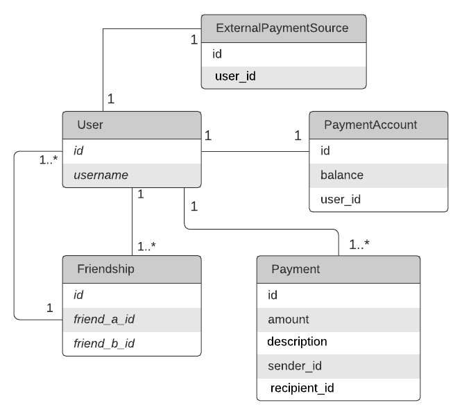
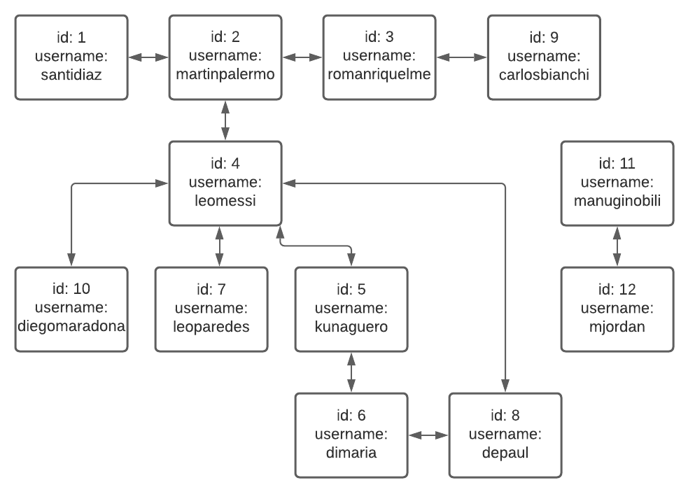

# Venmo API

Venmo is a mobile payment service which allows friends to transfer money to each other. It also has some social features like show your friends’ payment activities as feed.

This project contains unit tests, uses code analysis utilities and it is created with:
* Ruby 2.7.2
* Rails 6.0.3.5

## Features

The main features are: 
- Balance
  - You can get the balance value from the PaymentAccount that belongs to each User
- Payments
  - Users can send money between each other only if they are friends
- Feed
  - You can view a feed with all the activities from the current user and its friends up to second degree

## How to use

1. Clone this repo 
1. Install PostgreSQL in case you don't have it
1. Create your `database.yml` and `application.yml` file
1. `bundle install`
1. `rake db:create`
1. `rake db:migrate`
1. `rake db:seed`
1. `rspec` and make sure all tests pass
1. `rails s`
1. You can now try your REST services!

## Gems

- [ActiveAdmin](https://github.com/activeadmin/activeadmin) for easy administration
- [Arctic Admin](https://github.com/cprodhomme/arctic_admin) for responsive active admin
- [Annotate](https://github.com/ctran/annotate_models) for doc the schema in the classes
- [Better Errors](https://github.com/charliesome/better_errors) for a better error page
- [Brakeman](https://github.com/presidentbeef/brakeman) for static analysis security
- [Bullet](https://github.com/flyerhzm/bullet) help to kill N+1
- [Byebug](https://github.com/deivid-rodriguez/byebug) for debugging
- [DelayedJob](https://github.com/collectiveidea/delayed_job) for background processing
- [Devise](https://github.com/plataformatec/devise) for basic auth
- [Devise Token Auth](https://github.com/lynndylanhurley/devise_token_auth) for api auth
- [Dotenv](https://github.com/bkeepers/dotenv) for handling environment variables
- [Draper](https://github.com/drapergem/draper) for decorators
- [ExceptionHunter](https://github.com/rootstrap/exception_hunter) for exception tracking
- [Factory Bot](https://github.com/thoughtbot/factory_bot) for testing data
- [Faker](https://github.com/stympy/faker) for generating test data
- [Jbuilder](https://github.com/rails/jbuilder) for json views
- [Letter Opener](https://github.com/ryanb/letter_opener) for previewing a mail in the browser
- [Oj](https://github.com/ohler55/oj) for optimized json
- [Pagy](https://github.com/ddnexus/pagy) for pagination
- [Pry](https://github.com/pry/pry) for enhancing the ruby shell
- [Puma](https://github.com/puma/puma) for the server
- [Pundit](https://github.com/varvet/pundit) for authorization management
- [Rack CORS](https://github.com/cyu/rack-cors) for handling CORS
- [Rails Best Practices](https://github.com/flyerhzm/rails_best_practices) for rails linting
- [Reek](https://github.com/troessner/reek) for ruby linting
- [RSpec](https://github.com/rspec/rspec) for testing
- [Rspec API Doc Generator](https://github.com/zipmark/rspec_api_documentation) for API documentation
- [Rubocop](https://github.com/bbatsov/rubocop/) for ruby linting
- [Sendgrid](https://github.com/stephenb/sendgrid) for sending mails
- [Shoulda Matchers](https://github.com/thoughtbot/shoulda-matchers) adds other testing matchers
- [Simplecov](https://github.com/colszowka/simplecov) for code coverage
- [Webmock](https://github.com/bblimke/webmock) for stubbing http requests
- [Will Paginate](https://github.com/mislav/will_paginate) for pagination
- [YAAF](https://github.com/rootstrap/yaaf) for form objects

## Code quality

With `bundle exec rails code:analysis` you can run the code analysis tool, you can omit rules with:

- [Rubocop](https://github.com/bbatsov/rubocop/blob/master/config/default.yml) Edit `.rubocop.yml`
- [Reek](https://github.com/troessner/reek#configuration-file) Edit `config.reek`
- [Rails Best Practices](https://github.com/flyerhzm/rails_best_practices#custom-configuration) Edit `config/rails_best_practices.yml`
- [Brakeman](https://github.com/presidentbeef/brakeman) Run `brakeman -I` to generate `config/brakeman.ignore`
- [Bullet](https://github.com/flyerhzm/bullet#whitelist) You can add exceptions to a bullet initializer or in the controller

# ER Diagram



## Models

- User: The user in the system.
- Friendship: The relationship between two users as friends. A user can have one or more friends.
- Payment: The activity saved when a friend makes a payment to another.
- PaymentAccount: The account of the user that contains a balance value needed to make payments.
- ExternalPaymentSource: The external account of the user that is used when the user does not have enough balance value in its payment account to make a payment. 

## Services

- PaymentService: Contains the logic to create a Payment between two users. It validates the amount to be more than 0 and less than 1000. It validates if the users are friends. And it validates if the balance of the user's payment account is enough or if it will need to use the external payment source. Finally creates the payment and updates the balance values of the friends. 

- MoneyTransferService: Mocks an external payment source in order to add money to the user's balance if they do not have enough money to make a payment.

- FriendshipService: Contains the logic to ask if a user is friend of another. It also has the logic to get all the friends from an user up to second degree.

- FeedService: Contains the logic to find payments and list them on the feed for the current user and applies pagination, showing up to 10 items on each page.

# API Docs

Available endpoints:

`POST /user/{id}/payment`

Creates a payment from current user (from `{id}`) to send money to another user through `friend_id`

Params:
- friend_id (friend’s
user_id, integer)
- amount (payment amount, float)
- description (payment
description, string)

Body example JSON format:
```
{
    "friend_id": 1,
    "amount": 10,
    "description": "Beer"
}
```
Response example:
- Success: return 200 code with empty body.
- Failure: return HTTP error code with error description.

`GET /user/{id}/feed`

Shows a feed with all activities from current user (from `{id}`) and its friends up to second degree

Params:
- page (page_number
  for pagination, integer. If no page number in the params, return first page by default. Each page contains at most 10 feed items.)

body example JSON format:
```
{
    "page": 1
}
```
Response example:
- Success: return 200 code, body contains a list of feed items.
```
{
    "payments": [
        "martinpalermo paid santidiaz on 2021-08-24 20:01:50 UTC - Beer",
        "santidiaz paid martinpalermo on 2021-08-23 19:50:16 UTC - Pizza",
        "martinpalermo paid romanriquelme on 2021-08-22 19:50:16 UTC - Enjoy your present!",
        "martinpalermo paid leomessi on 2021-08-21 19:50:16 UTC - Shopping",
        "romanriquelme paid carlosbianchi on 2021-08-17 19:50:16 UTC - Tickets"
    ],
    "current_page": 1,
    "total_pages": 1
}
```
- Failure: return HTTP error code with error description.


`GET /user/{id}/balance`

Shows the balance of the payment account from current user (from `{id}`)

Params:
- No params

Response example:
- Success: return 200 code, body contains balance.
```
{
    "balance": 300.0
}
```
- Failure: return HTTP error code with error description.

## Seed

- After running `rake db:seeds` the database will be populated with the following users and the friendship between them:



- The payments created are the following:
```
 id: 1, amount: 20.0, description: "Pizza", recipient: martinpalermo, sender: santidiaz,
 id: 2, amount: 500.0, description: "Enjoy your present!", recipient: romanriquelme, sender: martinpalermo,
 id: 3, amount: 900.0, description: "Shopping", recipient: leomessi, sender: martinpalermo,
 id: 4, amount: 300.0, description: "Party", recipient: leoparedes, sender: leomessi,
 id: 5, amount: 999.0, description: "Happy Birthday!", recipient: leomessi, sender: diegomaradona,
 id: 6, amount: 40.0, description: "Thanks for your help", recipient: kunaguero, sender: dimaria,
 id: 7, amount: 5.0, description: "Tickets", recipient: carlosbianchi, sender: romanriquelme,
 id: 8, amount: 5.0, description: "Basket Jersey", recipient: mjordan, sender: manuginobili,
 id: 9, amount: 10.0, description: "Beer", recipient: santidiaz, sender: martinpalermo
```

- Their balances:
```
 ["santidiaz", 7010.0],
 ["martinpalermo", 6990.0],
 ["romanriquelme", 20.0],
 ["leomessi", 20.0],
 ["kunaguero", 500.0],
 ["dimaria", 0.0],
 ["leoparedes", 500.0],
 ["depaul", 10.0],
 ["carlosbianchi", 120.0],
 ["diegomaradona", 1000.0],
 ["manuginobili", 1.0],
 ["mjordan", 1.0]
```

## Code Owners

You can use [CODEOWNERS](https://help.github.com/en/articles/about-code-owners) file to define individuals or teams that are responsible for code in the repository.

Code owners are automatically requested for review when someone opens a pull request that modifies code that they own.

## Credits

Rails Api Base is maintained by [Rootstrap](http://www.rootstrap.com) with the help of our
[contributors](https://github.com/rootstrap/rails_api_base/contributors).

[](http://www.rootstrap.com)
